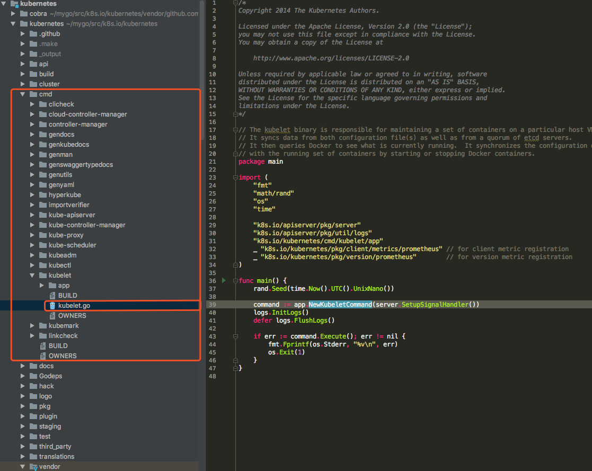

# kubelet

## kubelet大致说明

kubelet是在每个上运行的主要“节点代理”节点。 kubelet适用于PodSpec。

PodSpec是YAML或JSON对象描述一个pod。 

kubelet采用通过提供的一组PodSpecs各种机制（主要通过apiserver）并确保容器在那些PodSpecs中描述的运行和健康。
 
kubelet无法管理不是由Kubernetes创造的容器。 

除了来自apiserver的PodSpec之外，容器有三种方式清单可以提供给Kubelet。

File：Path在命令行上作为标志传递。将监视此路径下的文件定期更新。监控时间默认为20秒，可配置通过一面旗帜。

HTTP端点：在命令行上作为参数传递的HTTP端点。这个端点每20秒检查一次（也可以用标志配置）。

HTTP服务器：kubelet还可以侦听HTTP并响应简单的API（目前未提及）提交新清单。

## kubelet源码分析流程



1. main入口：k8s.io\kubernetes\cmd\kubelet\kubelet.go

```go
    func main() {
        rand.Seed(time.Now().UTC().UnixNano()) // 获取一个随机数
        command := app.NewKubeletCommand(server.SetupSignalHandler()) //初始化一个kubeletCommand的入口
        logs.InitLogs() // 初始化日志
        defer logs.FlushLogs()// 日志结束
        if err := command.Execute(); err != nil { // command初始化后，执行
            fmt.Fprintf(os.Stderr, "%v\n", err)
            os.Exit(1)
        }
    }
```

这个main函数是不是大家看着很亲切的感觉，我有这种感觉，就像发现新大陆一样

既然有这个main这个主入口，我们就分析代码，上面有注释，这里主要学习 NewKubeletCommand 函数;

大家有可能发现部分问题，历史老版本，这个NewKubeletCommand没有参数传入的，现在新版本是传入的。

参数为一个 chan struct{} 这种参数传入，非常方便。比较灵活。。。

server.SetupSignalHandler()函数注册两个信号量：已注册SIGTERM和SIGINT。返回一个停止通道，该通道在其中一个信号上关闭。如果捕获到第二个信号，程序将以退出代码1终止。

2. NewKubeletCommand函数分析

```go
// NewKubeletCommand使用默认参数创建*cobra.Command对象
func NewKubeletCommand(stopCh <-chan struct{}) *cobra.Command {

    // NewFlagSet返回一个新的空标志集，其中包含指定的名称，错误处理属性和SortFlags设置为true。
    cleanFlagSet := pflag.NewFlagSet(componentKubelet, pflag.ContinueOnError) 
  
    // SetNormalizeFunc允许您添加一个可以转换标志名称的函数。
    // 添加到FlagSet的标志将被翻译，然后当有任何东西试图查找也将被翻译的标志时。所以有可能创造 一个名为“getURL”的标志，并将其翻译为“geturl”。
    // 然后用户可以传递“--getUrl”，它也可以被翻译成“geturl”，一切都会正常工作。
    cleanFlagSet.SetNormalizeFunc(flag.WordSepNormalizeFunc)
    
    // NewKubeletFlags将使用默认值创建一个新的KubeletFlags
    kubeletFlags := options.NewKubeletFlags()
    
    // NewKubeletConfiguration将使用默认值创建新的KubeletConfiguration
    kubeletConfig, err := options.NewKubeletConfiguration()
    // programmer error
    if err != nil {
        glog.Fatal(err)
    }

    // 分装 command 结构
    cmd := &cobra.Command{
        Use: componentKubelet,
        Long: `... 一大堆文字说明，此处略...`,// 一大堆文字说明，此处略
        
        //  Kubelet具有特殊的标志解析要求来强制执行标志优先级规则，所以我们在下面的Run中手动完成所有解析。
        // DisableFlagParsing = true提供传递给kubelet的完整标志集`args` arg to Run，没有眼镜蛇的干扰。
        DisableFlagParsing: true,
        Run: func(cmd *cobra.Command, args []string) {...}, // `这里面放置一个匿名函数，后面详细说，看着代码就是比较多`
    }

    // 保持cleanFlagSet分开，因此Cobra不会用全局标志污染它
    kubeletFlags.AddFlags(cleanFlagSet)
    
    // AddKubeletConfigFlags将特定kubeletconfig.KubeletConfiguration的标志添加到指定的FlagSet
    options.AddKubeletConfigFlags(cleanFlagSet, kubeletConfig)
    
    // AddGlobalFlags显式地注册库（glog，verflag等）从“flag”和“github.com/spf13/pflag”注册全局标志集的标志。
    // 我们这样做是为了防止不需要的标志泄漏到Kubelet的标志集中。
    options.AddGlobalFlags(cleanFlagSet)
    cleanFlagSet.BoolP("help", "h", false, fmt.Sprintf("help for %s", cmd.Name()))

    // gly, but necessary，因为Cobra的默认UsageFunc和HelpFunc用全局标志影响flagset
    const usageFmt = "Usage:\n  %s\n\nFlags:\n%s"
    cmd.SetUsageFunc(func(cmd *cobra.Command) error {
        fmt.Fprintf(cmd.OutOrStderr(), usageFmt, cmd.UseLine(), cleanFlagSet.FlagUsagesWrapped(2))
        return nil
    })
    
    cmd.SetHelpFunc(func(cmd *cobra.Command, args []string) {
        fmt.Fprintf(cmd.OutOrStdout(), "%s\n\n"+usageFmt, cmd.Long, cmd.UseLine(), cleanFlagSet.FlagUsagesWrapped(2))
    })

    return cmd
}
```

[KubeletFlags结构（需要多看看）](struct_kubelet_flags.md)

上面的两个地方，内容篇幅过大，都删除了，做了文字说明。如果代码删减后，代码看着就比较清爽。详细看注释说明！！！
 
 3. cobra.Command{}
 
 这个主要是否分装方法传入的命令，进行分装处理；这个结构里面有一个run()接口，k8s 里面使用匿名函数.也可以理解为面向对象中的重写功能吧

[Command结构（需要多看看）](struct_command.md) 

现在主要看看command中的Run()接口内容：

```go
func(cmd *cobra.Command, args []string) {
	// 初始标志解析，因为我们禁用了cobra's标志解析
	if err := cleanFlagSet.Parse(args); err != nil {
		cmd.Usage()
		glog.Fatal(err)
	}

	// 检查命令行中是否存在非标志参数
	cmds := cleanFlagSet.Args()
	if len(cmds) > 0 {
		cmd.Usage()
		glog.Fatalf("unknown command: %s", cmds[0])
	}

	// short-circuit on help 帮助命令等返回
	help, err := cleanFlagSet.GetBool("help")
	if err != nil {
		glog.Fatal(`"help" flag is non-bool, programmer error, please correct`)
	}
	if help {
		cmd.Help()
		return
	}

	// short-circuit on VERFLAG 
	verflag.PrintAndExitIfRequested() // PrintAndExitIfRequested将检查是否已传递-version标志，如果是，则打印版本并退出。
	utilflag.PrintFlags(cleanFlagSet) // PrintFlags记录flagset中的标志

	// 从基于标志的初始配置设置功能门
	if err := utilfeature.DefaultFeatureGate.SetFromMap(kubeletConfig.FeatureGates); err != nil {
		glog.Fatal(err)
	}

	// 验证最初的KubeletFlags
	if err := options.ValidateKubeletFlags(kubeletFlags); err != nil {
		glog.Fatal(err)
	}

	if kubeletFlags.ContainerRuntime == "remote" && cleanFlagSet.Changed("pod-infra-container-image") {
		glog.Warning("Warning: For remote container runtime, --pod-infra-container-image is ignored in kubelet, which should be set in that remote runtime instead")
	}

	// 加载kubelet配置文件（如果提供）
	if configFile := kubeletFlags.KubeletConfigFile; len(configFile) > 0 {
		kubeletConfig, err = loadConfigFile(configFile) // 加载配置文件，生成默认的kubelet配置信息
		if err != nil {
			glog.Fatal(err)
		}
		// 我们必须通过将命令行重新解析为新对象来强制执行标志优先级。这对于保持二进制升级的向后兼容性是必要的。有关更多详细信息，请参阅问题＃56171。
		if err := kubeletConfigFlagPrecedence(kubeletConfig, args); err != nil {
			glog.Fatal(err)
		}
		// 根据新配置更新功能门
		if err := utilfeature.DefaultFeatureGate.SetFromMap(kubeletConfig.FeatureGates); err != nil {
			glog.Fatal(err)
		}
	}

	// 我们总是验证本地配置（命令行+配置文件）。这是动态配置的默认“last-known-good”配置，并且必须始终保持有效。
	if err := kubeletconfigvalidation.ValidateKubeletConfiguration(kubeletConfig); err != nil {
		glog.Fatal(err)
	}

	// 如果启用，请使用动态kubelet配置
	var kubeletConfigController *dynamickubeletconfig.Controller
	if dynamicConfigDir := kubeletFlags.DynamicConfigDir.Value(); len(dynamicConfigDir) > 0 {
		var dynamicKubeletConfig *kubeletconfiginternal.KubeletConfiguration
		dynamicKubeletConfig, kubeletConfigController, err = BootstrapKubeletConfigController(dynamicConfigDir,
			func(kc *kubeletconfiginternal.KubeletConfiguration) error {
				// 在这里，我们在控制器的验证序列之前强制执行控制器内的标志优先级，以便我们在决定拒绝动态配置的同一点获得完整的验证。这修复了问题＃63305的标志优先级组件。有关标志优先级的一般详细信息，请参阅问题＃56171。.
				return kubeletConfigFlagPrecedence(kc, args)
			})
		if err != nil {
			glog.Fatal(err)
		}
		// 如果我们应该使用现有的本地配置，控制器将返回一个nil配置
		if dynamicKubeletConfig != nil {
			kubeletConfig = dynamicKubeletConfig
			// Note: 在验证之前，我们的上述转换函数已经在控制器中强制执行了标记优先级。现在我们只需从新配置更新功能门。.
			if err := utilfeature.DefaultFeatureGate.SetFromMap(kubeletConfig.FeatureGates); err != nil {
				glog.Fatal(err)
			}
		}
	}

	// 依据beletFlags和bearConfig构建一个KubeletServer
	kubeletServer := &options.KubeletServer{
		KubeletFlags:         *kubeletFlags, 
		KubeletConfiguration: *kubeletConfig,
	}

	// 使用它来serveServer来构造默认的KubeletDeps
	kubeletDeps, err := UnsecuredDependencies(kubeletServer)
	if err != nil {
		glog.Fatal(err)
	}

	// 将loader配置控制器添加到loadDeps
	kubeletDeps.KubeletConfigController = kubeletConfigController

	// 如果启用，启动实验性docker shim
	if kubeletServer.KubeletFlags.ExperimentalDockershim {
		if err := RunDockershim(&kubeletServer.KubeletFlags, kubeletConfig, stopCh); err != nil {
			glog.Fatal(err)
		}
		return
	}

	// 运行kubelet
	glog.V(5).Infof("KubeletConfiguration: %#v", kubeletServer.KubeletConfiguration)
	/*
	    这里很重要，因为这里是启动程序入口
	*/
	if err := Run(kubeletServer, kubeletDeps, stopCh); err != nil { 
		glog.Fatal(err)
     }
}
```

上述文件内容大致说完
loadConfigFile 加载文件，生成配置信息（基本的）
UnsecuredDependencies 使用它来serveServer来构造默认的KubeletDeps

4. 
```go
	/*
	    这里很重要，因为这里是启动程序入口
	*/
	if err := Run(kubeletServer, kubeletDeps, stopCh); err != nil { 
		glog.Fatal(err)
     }
```
这个点，需要说一下，大多数参数配置等，这个入口是启动这些配置
func run(s *options.KubeletServer, kubeDeps *kubelet.Dependencies, stopCh <-chan struct{}) (err error) {...}
使用server（服务）,kubDeps（管理配置）,stopCh（信号量）来管理监听。

ValidateKubeletServer //验证初始KubeletServer（我们首先设置功能门，因为此验证取决于功能门）
initConfigz // 注册配置等
NewKubeletClientCertificateManager // 创建证书
UpdateTransport //我们将exitAfter设置为五分钟，因为我们使用此客户端配置来请求新证书 - 如果我们无法
                //要申请新证书，我们将无法继续正常运作。退出该过程允许包装器
                //或bootstrapping凭证可能会放置新的初始配置
clientset.NewForConfig(clientConfig) 初始化一个配置

以上总结：
1。看似简单，进入后觉得里面很多东西都不知道，只能跟着代码藤一步步往下走
2. 当你耐下寂寞，帮整体的看完时，你发现，原理之前看到，可以不看，重点的入口明白后，大意明白后，心里有一个脉络图，你就明白了

#### 参考文件


[k8s源代码分析-----kubelet（1）主要流程](https://www.cnblogs.com/slgkaifa/p/7308368.html)